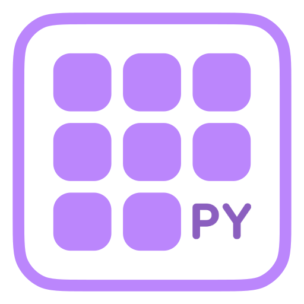
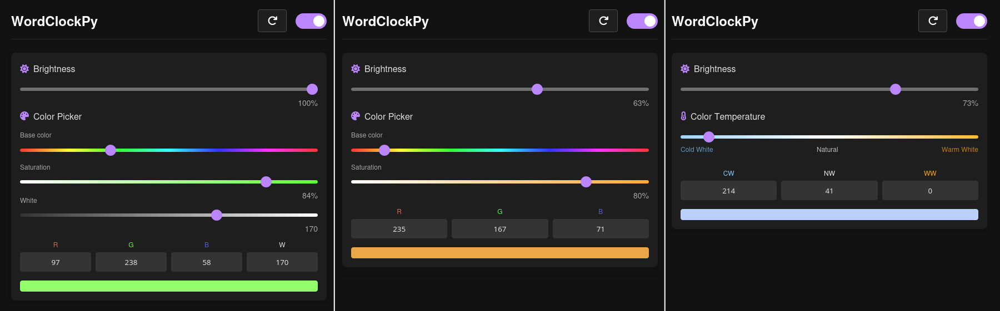
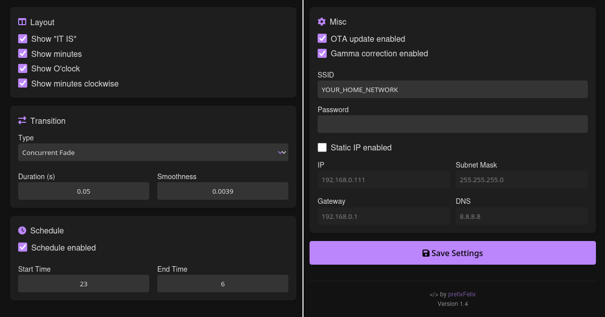

<p align="center">

</p>
<h1 align="center">WordClockPy</h1>

Yet another **word clock** / **Wortuhr** project... For a more battle-tested software, use [ESPWortuhr](https://github.com/ESPWortuhr/Multilayout-ESP-Wordclock).

## Features

- Supports very flexible led strip layouts
  - Any number of leds in X/Y direction
  - Horizontal / vertical alignment1
  - Use any corner of the clock as your first led
- Support for RGB, RGBW and WWA led strips
- Responsive web interface
- ESP32 / ESP8266 platform
- MicroPython, easy to edit

## Screenshots

Depending on the led type, the color selection in the web interface also changes. The rest of the interface remains the same. A complete screenshot can be found [here](img/full-web-interface.png).

<p align="center">

</p>
<p align="center">

</p>


## Installation (Linux)

### 0. Flash MicroPython

Before WordClockPy can be installed, the MicroPython firmware must be flashed onto the ESP. If MicroPython is already running on your ESP you can skip this step. A more detailed tutorial can be found [here](https://docs.micropython.org/en/latest/esp8266/tutorial/intro.html).

1. Install the [esptool](https://github.com/espressif/esptool/) CLI. 

   ```shell
   pipx install esptool
   ```

2. Download the appropriate firmware for the micro controller [here](https://micropython.org/download/). The file must be in binary format (.bin).

4. Connect the micro controller to your PC and find out which device file is used to communicate with the ESP. By default it should be `/dev/ttyUSB0`. Alternatively, you can also determine it via the command: `sudo dmesg | grep tty`. The output should look similar to this and provide information about the used file.

   ```shell
   $ sudo dmesg | grep tty
   [435144.714226] usb 1-1: ch341-uart converter now attached to ttyUSB0
   ```

5. Erase the flash of the ESP.

   ```shell
   esptool --port /dev/ttyUSB0 erase-flash
   ```

6. Flash the MicroPython firmware.

   ```shell
   esptool --port /dev/ttyUSB0 --baud 460800 write-flash --flash-size=detect --flash-mode dout 0x0 ESP32_GENERIC-<YOUR-VERSION>.bin
   ```

   Port and the name of the firmware should of course be changed by you as needed.

### 1. Prepare WordClockPy

1. Install the latest version of the [mpremote](https://docs.micropython.org/en/latest/reference/mpremote.html) CLI.
   ```shell
   pipx install mpremote
   ```

2. Clone the WordClockPy repository.

   ```shell
   git clone https://github.com/prefixFelix/WordClockPy.git
   ```

3. Edit the `src/config.py` file. The following values should be configured, the rest can be changed later via the web interface:
   ```python
   wifi_ssid = 'YOUR_NETWORK_NAME'
   wifi_passwd = 'YOUR_NETWORK_PASSWORD'
   
   data_pin = 22                   			# GPIO of the LED data pin
   time_zone = 1                   			# Timezone hour offset from UTC
   
   orientation = 'vertical'                    # vertical, horizontal
   first_led = 'top_left'                      # top_left, top_right, bottom_left, bottom_right
   x_max = 11                                  # LED count x-axis
   y_max = 10                                  # LED count y-axis
   led_type = 'RGBW'                           # Strip type: RGB, RGBW, WWA
   language = language_file.lang_german        # Language from language.py
   ```

4. If you want, you can also add a new language to the `src/language.py` file. Take a look at the *language dict explanation* comment. 

### 2. Flash WordClockPy

1. Remove all files from the micro controller.

   ```shell
   mpremote connect /dev/ttyUSB0 rm -r :/
   ```

2. Copy WordClockPy on the micro controller.

   ```shell
   cd WordClockPy/
   mpremote connect /dev/ttyUSB0 cp -r src/. :
   ```

3. Now reset the ESP and verify that everything is running correctly by looking at the output of the serial interface. The LED strips should not yet be connected! You can also find the IP address here, which is useful if you have not set a static one.
   ```
   mpremote connect /dev/ttyUSB0
   ```

4. Disconnect the ESP from the PC and connect it to the clock as follows:

   | ESP      | 5V power supply | LED strip |
   | -------- | --------------- | --------- |
   | GND      | GND             | GND       |
   | 5V VCC   | 5V              | 5V        |
   | DATA PIN | -               | DATA      |

5. Open the web interface by entering the ESPs IP in your browser and enjoy your new word clock.

> [!CAUTION]
> **NEVER** connect the ESP to USB and the external 5V power supply at the **SAME TIME**!

## Example layout

The illustrations show all possible combinations in which the clock can be operated. The size of the clock in the X and Y directions can also be adjusted as required. Only the standard 11x10 size is shown here.

> [!NOTE]
> So far, only the vertical 11x10 layout with the first led in the top left corner has been tested. However, the others should also work.

```
        - Vertical / First LED bottom left -                        - Vertical / First LED bottom right -
┌───┬───────────────────────────────────────────┬───┐       ┌───┬───────────────────────────────────────────┬───┐
│011├─────┐                                   ┌─┤113│       │113├─┐                                   ┌─────┤011│
├─┬─┘     │   ┌───┐   ┌───┐   ┌───┐   ┌───┐   │ └───┤       ├───┘ │   ┌───┐   ┌───┐   ┌───┐   ┌───┐   │     └─┬─┤
│ └──010 012 031 032 051 052 071 072 091 092 112    │       │    112 092 091 072 071 052 051 032 031 012 010──┘ │
│    009 013 030 033 050 053 070 073 090 093 111    │       │    111 093 090 073 070 053 050 033 030 013 009    │
│    008 014 029 034 049 054 069 074 089 094 110    │       │    110 094 089 074 069 054 049 034 029 014 008    │
│    007 015 028 035 048 055 068 075 088 095 109    │       │    109 095 088 075 068 055 048 035 028 015 007    │
│    006 016 027 036 047 056 067 076 087 096 108    │       │    108 096 087 076 067 056 047 036 027 016 006    │
│    005 017 026 037 046 057 066 077 086 097 107    │       │    107 097 086 077 066 057 046 037 026 017 005    │
│    004 018 025 038 045 058 065 078 085 098 106    │       │    106 098 085 078 065 058 045 038 025 018 004    │
│    003 019 024 039 044 059 064 079 084 099 105    │       │    105 099 084 079 064 059 044 039 024 019 003    │
│    002 020 023 040 043 060 063 080 083 100 104    │       │    104 100 083 080 063 060 043 040 023 020 002    │
│    001 021 022 041 042 061 062 081 082 101 103──┐ │       │ ┌──103 101 082 081 062 061 042 041 022 021 001    │
├───┐ │   └───┘   └───┘   └───┘   └───┘   │     ┌─┴─┤       ├─┴─┐     │   └───┘   └───┘   └───┘   └───┘   │ ┌───┤
│000├─┘                                   └─────┤102│       │102├─────┘                                   └─┤000│
└───┴───────────────────────────────────────────┴───┘       └───┴───────────────────────────────────────────┴───┘

          - Vertical / First LED top left -                           - Vertical / First LED top right -
┌───┬───────────────────────────────────────────┬───┐       ┌───┬───────────────────────────────────────────┬───┐
│000├─┐                                   ┌─────┤102│       │102├─────┐                                   ┌─┤000│
├───┘ │   ┌───┐   ┌───┐   ┌───┐   ┌───┐   │     └─┬─┤       ├─┬─┘     │   ┌───┐   ┌───┐   ┌───┐   ┌───┐   │ └───┤
│    001 021 022 041 042 061 062 081 082 101 103──┘ │       │ └──103 101 082 081 062 061 042 041 022 021 001    │
│    002 020 023 040 043 060 063 080 083 100 104    │       │    104 100 083 080 063 060 043 040 023 020 002    │
│    003 019 024 039 044 059 064 079 084 099 105    │       │    105 099 084 079 064 059 044 039 024 019 003    │
│    004 018 025 038 045 058 065 078 085 098 106    │       │    106 098 085 078 065 058 045 038 025 018 004    │
│    005 017 026 037 046 057 066 077 086 097 107    │       │    107 097 086 077 066 057 046 037 026 017 005    │
│    006 016 027 036 047 056 067 076 087 096 108    │       │    108 096 087 076 067 056 047 036 027 016 006    │
│    007 015 028 035 048 055 068 075 088 095 109    │       │    109 095 088 075 068 055 048 035 028 015 007    │
│    008 014 029 034 049 054 069 074 089 094 110    │       │    110 094 089 074 069 054 049 034 029 014 008    │
│    009 013 030 033 050 053 070 073 090 093 111    │       │    111 093 090 073 070 053 050 033 030 013 009    │
│ ┌──010 012 031 032 051 052 071 072 091 092 112    │       │    112 092 091 072 071 052 051 032 031 012 010──┐ │
├─┴─┐     │   └───┘   └───┘   └───┘   └───┘   │ ┌───┤       ├───┐ │   └───┘   └───┘   └───┘   └───┘   │     ┌─┴─┤
│011├─────┘                                   └─┤113│       │113├─┘                                   └─────┤011│
└───┴───────────────────────────────────────────┴───┘       └───┴───────────────────────────────────────────┴───┘

# ------------------------------------------------------------------------------------------------------------- #

        - Horizontal / First LED bottom left -                      - Horizontal / First LED bottom right -
┌───┬───────────────────────────────────────────┬───┐       ┌───┬───────────────────────────────────────────┬───┐
│113│                                         ┌─┤101│       │101├─┐                                         │113│
├─┬─┘                                         │ └─┬─┤       ├─┬─┘ │                                         └─┬─┤
│ └──112 111 110 109 108 107 106 105 104 103 102  │ │       │ │  102 103 104 105 106 107 108 109 110 111 112──┘ │
│ ┌──090 091 092 093 094 095 096 097 098 099 100──┘ │       │ └──100 099 098 097 096 095 094 093 092 091 090──┐ │
│ └──089 088 087 086 085 084 083 082 081 080 079──┐ │       │ ┌──079 080 081 082 083 084 085 086 087 088 089──┘ │
│ ┌──068 069 070 071 072 073 074 075 076 077 078──┘ │       │ └──078 077 076 075 074 073 072 071 070 069 068──┐ │
│ └──067 066 065 064 063 062 061 060 059 058 057──┐ │       │ ┌──057 058 059 060 061 062 063 064 065 066 067──┘ │
│ ┌──046 047 048 049 050 051 052 053 054 055 056──┘ │       │ └──056 055 054 053 052 051 050 049 048 047 046──┐ │
│ └──045 044 043 042 041 040 039 038 037 036 035──┐ │       │ ┌──035 036 037 038 039 040 041 042 043 044 045──┘ │
│ ┌──024 025 026 027 028 029 030 031 032 033 034──┘ │       │ └──034 033 032 031 030 029 028 027 026 025 024──┐ │
│ └──023 022 021 020 019 018 017 016 015 014 013──┐ │       │ ┌──013 014 015 016 017 018 019 020 021 022 023──┘ │
│ ┌──001 002 003 004 005 006 007 008 009 010 011  │ │       │ │  011 010 009 008 007 006 005 004 003 002 001──┐ │
├─┴─┐                                         │ ┌─┴─┤       ├─┴─┐ │                                         ┌─┴─┤
│000│                                         └─┤012│       │012│─┘                                         │000│
└───┴───────────────────────────────────────────┴───┘       └───┴───────────────────────────────────────────┴───┘

        - Horizontal / First LED top left -                         - Horizontal / First LED top right -  
┌───┬───────────────────────────────────────────┬───┐       ┌───┬───────────────────────────────────────────┬───┐
│000│                                         ┌─┤012│       │012├─┐                                         │000│
├─┬─┘                                         │ └─┬─┤       ├─┬─┘ │                                         └─┬─┤
│ └──001 002 003 004 005 006 007 008 009 010 011  │ │       │ │  011 010 009 008 007 006 005 004 003 002 001──┘ │
│ ┌──023 022 021 020 019 018 017 016 015 014 013──┘ │       │ └──013 014 015 016 017 018 019 020 021 022 023──┐ │
│ └──024 025 026 027 028 029 030 031 032 033 034──┐ │       │ ┌──034 033 032 031 030 029 028 027 026 025 024──┘ │
│ ┌──045 044 043 042 041 040 039 038 037 036 035──┘ │       │ └──035 036 037 038 039 040 041 042 043 044 045──┐ │
│ └──046 047 048 049 050 051 052 053 054 055 056──┐ │       │ ┌──056 055 054 053 052 051 050 049 048 047 046──┘ │
│ ┌──067 066 065 064 063 062 061 060 059 058 057──┘ │       │ └──057 058 059 060 061 062 063 064 065 066 067──┐ │
│ └──068 069 070 071 072 073 074 075 076 077 078──┐ │       │ ┌──078 077 076 075 074 073 072 071 070 069 068──┘ │
│ ┌──089 088 087 086 085 084 083 082 081 080 079──┘ │       │ └──079 080 081 082 083 084 085 086 087 088 089──┐ │
│ └──090 091 092 093 094 095 096 097 098 099 100──┐ │       │ ┌──100 099 098 097 096 095 094 093 092 091 090──┘ │
│ ┌──112 111 110 109 108 107 106 105 104 103 102  │ │       │ │  102 103 104 105 106 107 108 109 110 111 112──┐ │
├─┴─┐                                         │ ┌─┴─┤       ├─┴─┐ │                                         ┌─┴─┤
│113│                                         └─┤101│       │101│─┘                                         │113│
└───┴───────────────────────────────────────────┴───┘       └───┴───────────────────────────────────────────┴───┘
```

## Known issues

- Loading the OTA update can sometimes take a little longer (~2min)
